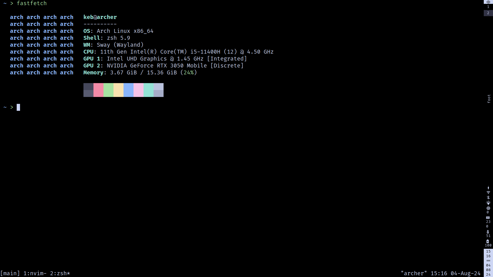
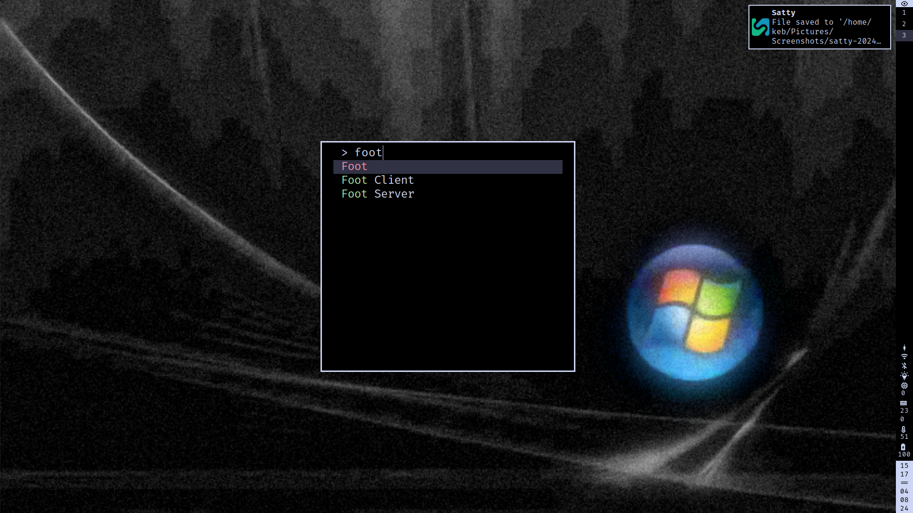
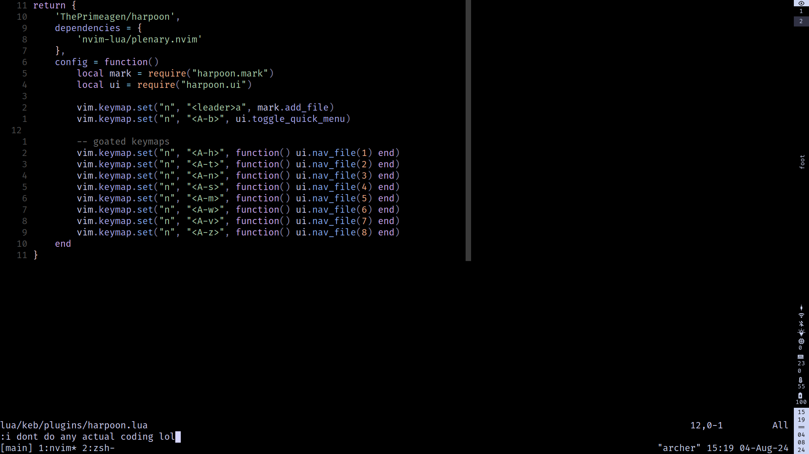

# keb's dotfiles (WIP)

my dotfiles






## install

```bash
stow .
git clone https://github.com/tmux-plugins/tpm ~/.tmux/plugins/tpm
# in tmux -> prefix+I

# TODO: /usr/share/wayland-sessions/sway.desktop --unsupported-gpu fix
# TODO: /etc/vconsole.conf dvorak
```
