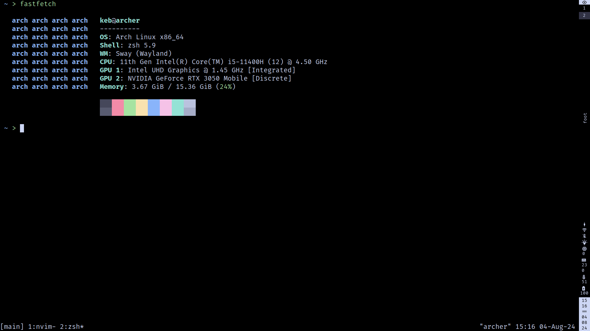
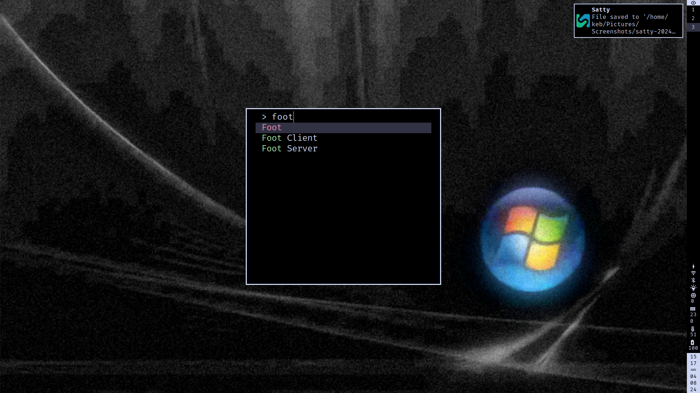
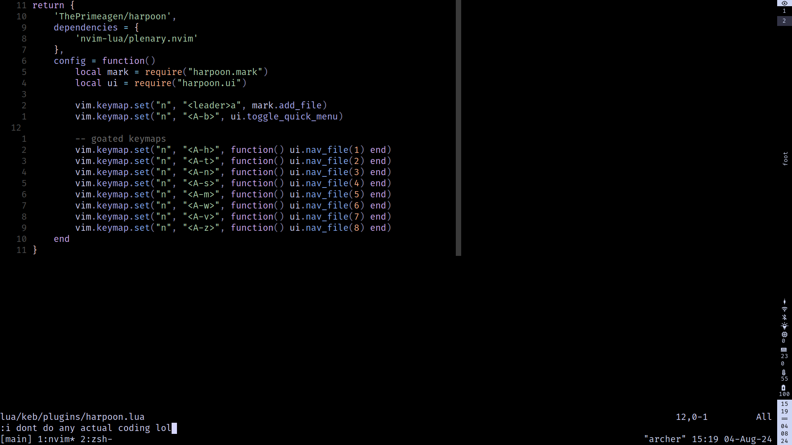

# keb's dotfiles

my dotfiles





## install

```bash
stow *foldername*
git clone https://github.com/tmux-plugins/tpm ~/.tmux/plugins/tpm
# in tmux -> prefix+I

# TODO: /usr/share/wayland-sessions/sway.desktop --unsupported-gpu fix
# TODO: /etc/vconsole.conf dvorak
# TODO: xdg-user-dirs-update
# TODO: gsettings set org.gnome.desktop.interface gtk-enable-primary-paste false

# TODO: fix mpd lol
systemctl disable mpd.socket
systemctl disable mpd
systemctl stop mpd.socket
systemctl stop mpd
systemctl --user enable mpd.socket
systemctl --user enable mpd
systemctl --user start mpd.socket
systemctl --user start mpd
```
